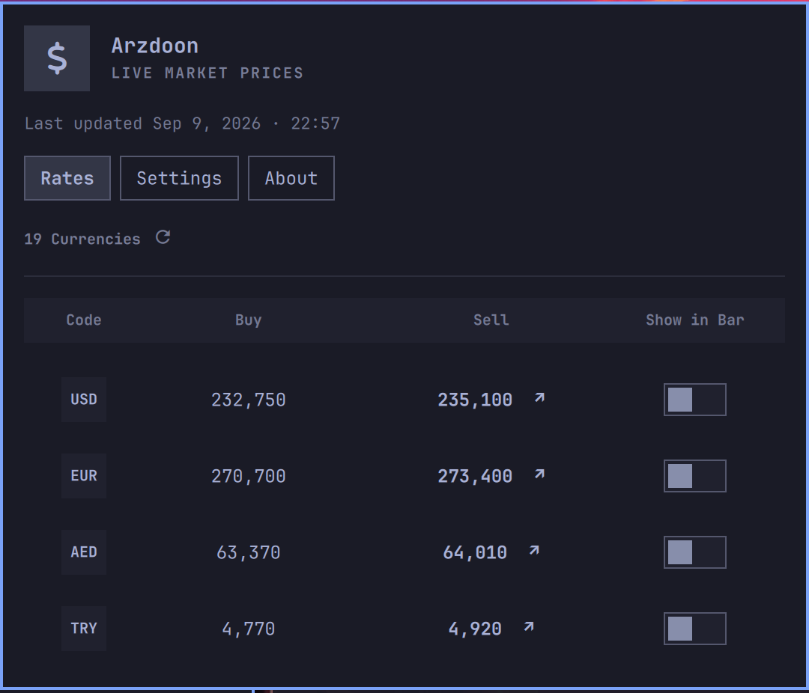
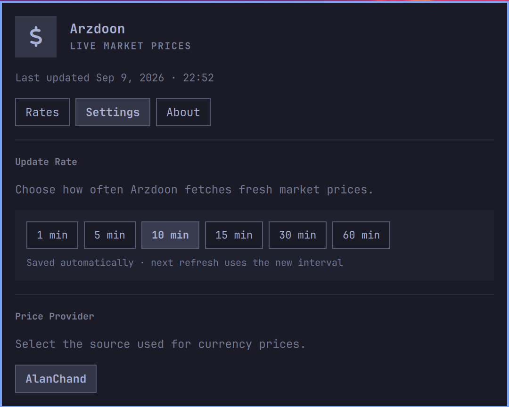

[](https://github.com/mamal72/omarchy-arzdoon/actions/workflows/ci.yml)

# 💱 Arzdoon

Arzdoon is an Omarchy bar plugin for live Iranian currency prices. It provides a compact buy/sell table, lets you show selected sell rates directly in the bar, and keeps the last successful snapshot available when the source is temporarily unreachable.

## 📸 Screenshots

| Rates | Settings |
| :---: | :---: |
|  |  |

## ✨ Features

- Compact, scrollable table of live buy and sell prices
- Per-currency **Show in Bar** switches for selected sell rates
- A concise `$` bar item without duplicated currency symbols or trend arrows
- Canonical currency ordering with Istanbul dollar excluded
- Configurable refresh interval and price provider
- Local last-updated time in English Gregorian format
- Cached prices during temporary connection failures
- Placement-aware popup that follows the widget's bar section
- Native Omarchy styling with horizontal and vertical bar support

## 📋 Requirements

- A current Omarchy installation with shell plugin support
- An internet connection for price updates

Arzdoon has no third-party Python dependencies.

## 📦 Install

Run:

```bash
omarchy plugin add https://github.com/mamal72/omarchy-arzdoon.git --enable
```

Omarchy will ask you to confirm the plugin and choose whether to place it in the left, center, or right section of the bar.

If the plugin is installed but not visible, enable it with:

```bash
omarchy plugin enable arzdoon
```

## 🔄 Update

```bash
omarchy plugin update arzdoon
```

## 🗑️ Remove

```bash
omarchy plugin remove arzdoon
```

## 🖱️ Usage

- Left-click the `$` bar item to open or close the panel.
- Middle-click the bar item to refresh prices.
- Press `R` while the panel is open to refresh prices.
- Use a currency's **Show in Bar** switch to add or remove its sell rate from the bar.

The Rates tab follows a consistent currency order and excludes Istanbul dollar. Currencies that are not in the canonical list retain their source order at the end.

## ⚙️ Settings

Open the Settings tab to choose the price provider and refresh interval. Arzdoon's Omarchy settings also expose the maximum number of rates that can be shown in the bar.

Selections are saved per provider. State is stored at `$XDG_STATE_HOME/omarchy/arzdoon/state.json`, and the last successful snapshot is cached at `$XDG_CACHE_HOME/arzdoon/snapshot.json`.

## 🛠️ Development

Clone the repository into the user plugin directory:

```bash
git clone https://github.com/mamal72/omarchy-arzdoon.git ~/.config/omarchy/plugins/arzdoon
```

Validate the plugin and run the tests:

```bash
cd ~/.config/omarchy/plugins/arzdoon
omarchy plugin validate .
python -m unittest discover -s tests -v
```

GitHub Actions runs the test suite on Python 3.12, 3.13, and 3.14, checks Python formatting and types, validates the manifest, and parses both QML entry points. Pushing a version tag such as `v1.0.1` publishes a GitHub release after every check passes; the tag must match the version in `manifest.json`.

To add another price source, create an adapter under `providers/` with `INFO` and `fetch(timeout)`, then register it in `providers/__init__.py`. Provider adapters return a shared snapshot shape; filtering and display order are applied independently of the provider.

## ☕ Support My Work

If Arzdoon is useful to you, you can [Buy Me a Coffee](https://buymeacoffee.com/mamal72).

## 📄 License

Arzdoon is available under the [MIT License](LICENSE).
